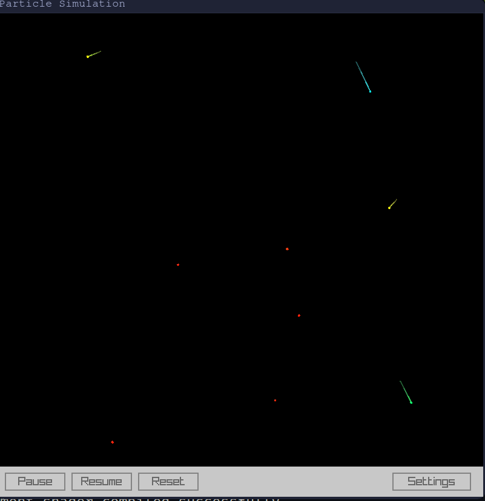

# particle-sim
Particle "simulator" made just for fun. While it's not a scientifically accurate simulation, it provides an engaging and interactive way to explore how particles behave under various settings.

This project is written in C, utilizing the Raylib library for graphics and the Raygui library for GUI controls.

# Features
- Dynamic Particle Simulation: Watch particles interact with customizable properties like speed, mass, and lifetime.
- Explosions: Simulate particle explosions with adjustable parameters.
- Virtual Particles: Add virtual particle interactions and experiment with unique configurations.
- Physics Customization: Adjust forces, gravity, and other physics settings.
- Interactive GUI: Configure the simulation in real-time using a clean and intuitive settings panel.

# Installation
1. Clone the repository
```bash
git clone https://github.com/sanchezhs/particle-sim.git
```
2. Navigate to the project directory
```bash
cd particle-sim
```

3. Compile the program
```bash
make
```

4. Run the simulator
```bash
./simulation
```

# Usage

The simulator has two primary modes:
- Simulation Mode: Watch the particles move and interact based on the configured settings.
- Settings Panel: Pause the simulation and adjust various settings to tweak particle behavior and physical properties.

Interactivity
- Pause/Resume: Temporarily pause the simulation to adjust parameters or observe a static frame.
- Reset: Restart the simulation with the current settings.
- Settings: Access detailed customization options for particles, physics, and explosions.

Experiment with different configurations and observe how particles behave in various scenarios.

# Examples
Screenshot of the program. It has two parts:
1. Simulation: Where the partiles live
2. Config: `Pause`, `Resume`, `Reset` the simulation and `Settings`


Particle settings


Particle explosions settings


Virtual particle settings


General settings relative to physics


# Known Issues (TODO)

- Segmentation Faults: Some settings combinations may lead to segmentation faults.