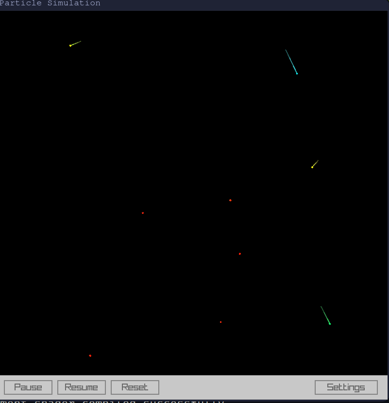
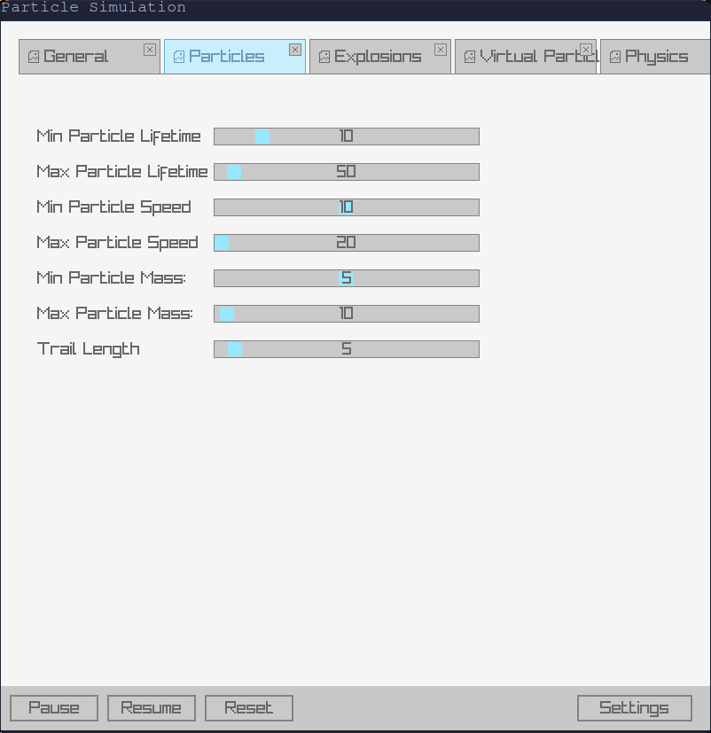
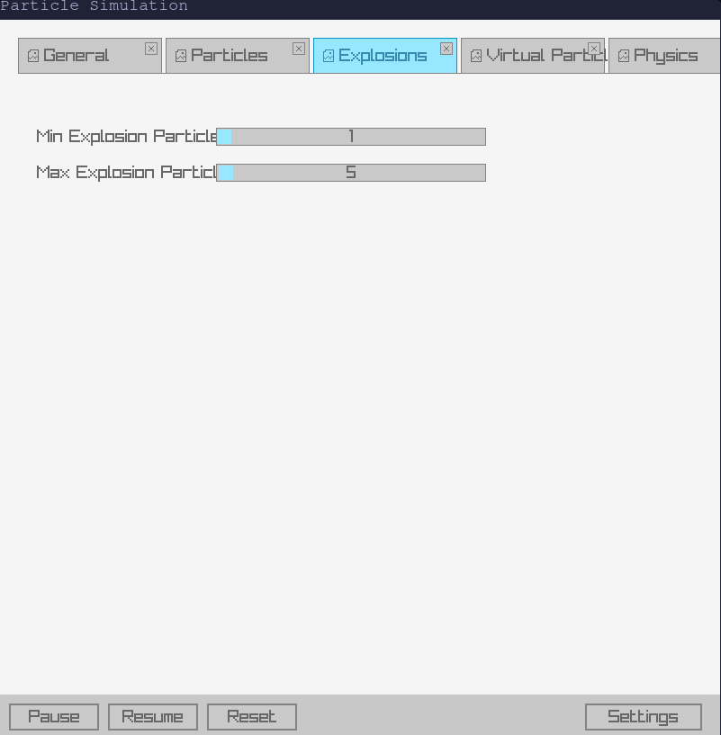
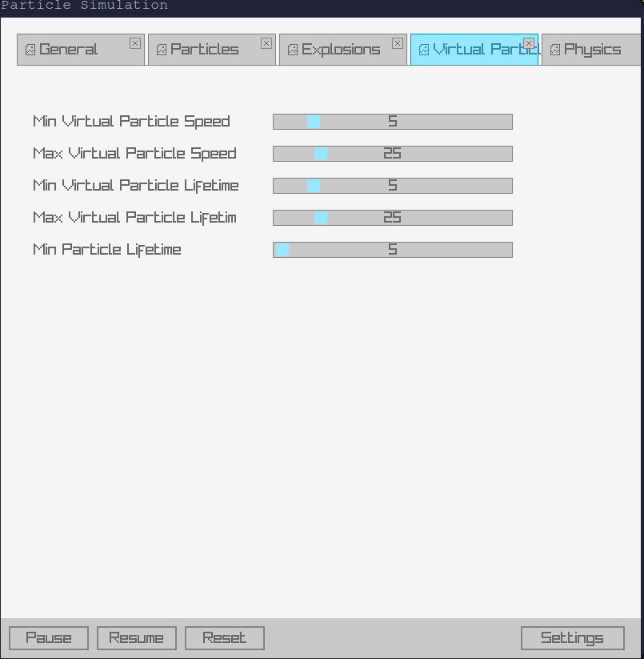
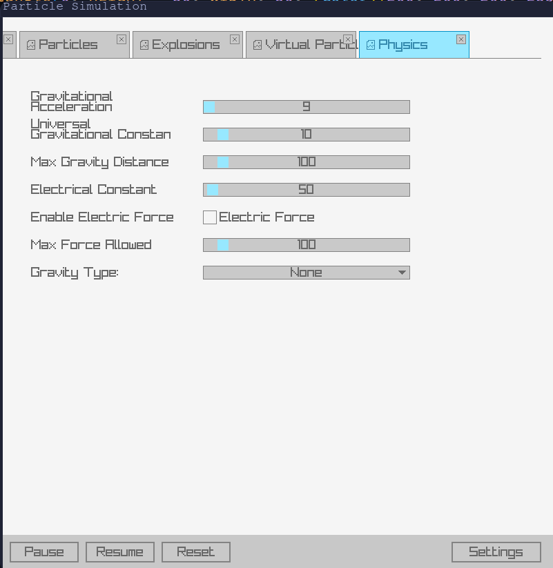

# ParticleSim


**ParticleSim** is a particle simulator developed in C, leveraging the power of the [Raylib](https://www.raylib.com/) graphics library and the [raygui](https://github.com/raysan5/raygui) library for intuitive GUI controls. Compiled to WebAssembly using **Emscripten**, ParticleSim offers both desktop and web-based interfaces, allowing users to explore and manipulate particle behaviors interactively.

While not intended as a scientifically precise simulation, ParticleSim provides a rich and engaging platform for experimenting with particle dynamics, physics customization, and visual effects, making it an excellent tool for educational purposes, demonstrations, and creative explorations.

## Table of Contents

- [Features](#features)
- [Technologies Used](#technologies-used)
- [Installation](#installation)
  - [Prerequisites](#prerequisites)
  - [Steps](#steps)
- [Usage](#usage)
  - [Simulation Mode](#simulation-mode)
  - [Settings Panel](#settings-panel)
- [Live Demo](#live-demo)
- [Examples](#examples)
- [Contributing](#contributing)
- [License](#license)
- [Acknowledgements](#acknowledgements)

## Features

- **Dynamic Particle Simulation:** Observe particles interacting with customizable attributes such as speed, mass, and lifetime. Adjust these properties in real-time to see immediate effects on the simulation.

- **Explosions:** Create and manage particle explosions with adjustable parameters, enabling the simulation of dynamic and visually appealing events.

- **Virtual Particles:** Introduce virtual particle interactions, allowing for complex configurations and unique behaviors within the simulation environment.

- **Physics Customization:** Fine-tune physical forces, gravity settings, and other physics-related parameters to explore various scenarios and their impacts on particle movements.

- **Interactive GUI:** Utilize a clean and intuitive settings panel powered by raygui, enabling seamless configuration of simulation parameters without interrupting the simulation flow.

- **WebAssembly Support:** Compile the simulation to WebAssembly using Emscripten, making ParticleSim accessible directly from modern web browsers without the need for additional installations.

## Technologies Used

- [**C**](https://www.iso.org/standard/74528.html): The core programming language used for developing ParticleSim, offering performance and control over system resources.

- [**Raylib**](https://www.raylib.com/): A simple and easy-to-use library to enjoy videogames programming, providing robust graphics capabilities for rendering particles and effects.

- [**raygui**](https://github.com/raysan5/raygui): A simple and easy-to-use immediate-mode GUI library based on Raylib, facilitating the creation of interactive and customizable GUI elements.

- [**cJSON**](https://github.com/DaveGamble/cJSON): A lightweight JSON parser in C, enabling efficient parsing and handling of configuration data in JSON format.

- [**Emscripten**](https://emscripten.org/): A complete compiler toolchain that allows compiling C code into WebAssembly, bridging the gap between native applications and web technologies.

## Installation

### Prerequisites

Before you begin, ensure you have met the following requirements:

- **Compiler:** GCC or Clang for compiling C code.
- **Emscripten:** Required for compiling to WebAssembly.
- **Make:** A build automation tool for managing compilation steps.
- **Git:** For cloning the repository and managing submodules.

### Steps

1. **Clone the Repository:**

    ```bash
    git clone https://github.com/sanchezhs/particle-sim.git
    cd particle-sim
    ```

2. **Initialize and Update Submodules:**

    ParticleSim uses Git submodules to manage external dependencies like Raylib. Initialize and update them with:

    ```bash
    git submodule update --init --recursive
    ```

3. **Install Dependencies:**

    - **Raylib:** Ensure Raylib is properly installed and its path is correctly set in your environment.
    - **Emscripten:** Follow the [Emscripten Getting Started Guide](https://emscripten.org/docs/getting_started/downloads.html) to install and activate Emscripten.

4. **Compile the Program:**

    - **For Desktop (Linux/macOS):**

        ```bash
        make
        ```

    - **For Web (WebAssembly):**

        ```bash
        make PLATFORM=PLATFORM_WEB
        ```

5. **Run the Simulator:**

    - **Desktop Version:**

        ```bash
        ./simulation
        ```

    - **Web Version:**

        Open `simulation.html` in your preferred web browser. For a better experience, serve the files using a local web server:

        ```bash
        python3 -m http.server
        ```

        Then navigate to `http://localhost:8000/simulation.html` in your browser.

## Usage

ParticleSim offers an interactive environment where users can observe and manipulate particle behaviors in real-time. The application is divided into two primary modes:

### Simulation Mode

- **Overview:** Watch particles move and interact based on the current configuration settings.
- **Interactions:** Observe how changes in particle properties and physics settings influence the simulation dynamics.

### Settings Panel

- **Access:** Click on the "Settings" button to open the configuration panel.
- **Configuration Options:**
  - **General Settings:** Adjust global parameters like the number of particles, friction, and simulation seed.
  - **Patterns:** Choose initial particle distribution patterns such as random, vortex, or group formations.
  - **Particles:** Customize particle-specific properties including lifetime, speed, mass, and trail length.
  - **Explosion:** Configure parameters for particle explosions, such as the number of particles involved.
  - **Physics:** Modify physical forces, gravity types, and enable or disable electric forces.

### Interactivity

- **Pause/Resume:** Temporarily halt the simulation to adjust settings or analyze a static frame.
- **Reset:** Restart the simulation with the current configuration parameters.
- **Apply Configuration:** Commit your changes in the settings panel to update the simulation in real-time.

Experiment with various configurations to explore different particle behaviors and physical interactions.

## Live Demo

Experience ParticleSim directly from your browser without any installations:

[https://sanchezhs.github.io/particle-simulation/](https://sanchezhs.github.io/particle-simulation/)

## Examples

Explore some of the captivating simulations created with ParticleSim:

### Full Program



### Dynamic Particle Settings



### Particle Explosions



### Virtual Particle Interactions



### Physics Customizations



## License

Distributed under the MIT License. See `LICENSE` for more information.

## Acknowledgements

- [Raylib](https://www.raylib.com/)
- [raygui](https://github.com/raysan5/raygui)
- [cJSON](https://github.com/DaveGamble/cJSON)
- [Emscripten](https://emscripten.org/)

# TODO
- **Responsive Design**
- **Screenshots**
- **Live particle stats**
- **Create random initial states and allow user to save them**